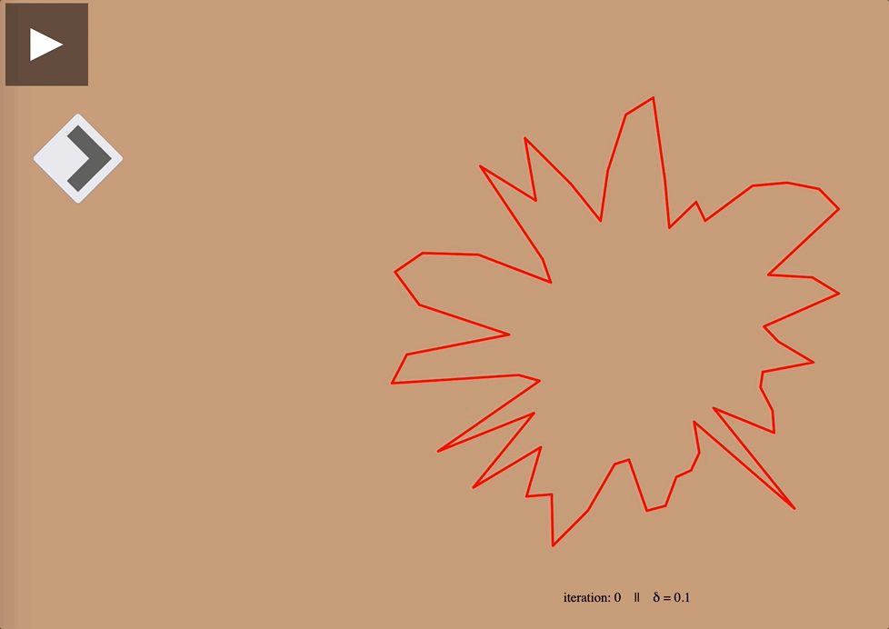

# Discrete Curve Shortening Flow Demos

Discrete curve shortening flow is a heat like flow that deforms a simple closed polygon in the direction of the normal at a vertex. The flow *smooths* and shrinks a polygon until it becomes a regular polygon in the limit. A regular polygon has sides equal length and equal angle, like a square or equilateral triangle.

Discretization of the flow gives the following update rule for any vertex $v_i$ at time index $i$,

$v_{i+1} = v_{i} + \delta n_i$.

Where $n_i = (v_{i+1} - v_{i}) + (v_{i-1} - v_{i})$ is the approximate normal at vertex $v_i$ at time index $i$. Delta, $\delta$, controls the speed of the flow.

Reference [Discrete and Computational Geometry][1]. 

There are two demos:

### Random Simple $N$-sided Polygon

Script `src/main.js` generates a simple $N$-sided polygon, which bounds a simply connected region.

<figure>
<div align="center">
	
</div>
</figure>

Click the ***play*** button to run the flow uninterrupted, and ***pause*** to stop the flow. The ***right arrow*** advances the flow by a single iteration.

### Simple $N$-sided Spiral Polygon

Script `src/curve-shortening-flow-spiral.js` generates a $N$-sided polygon, which bounds a simply connected region. Furthermore, the polygon is shapped like a [litus spiral][3]. 

## Setup

Install dependencies [three.js][2] via `npm`, and run a local server.

```
npm install --save three
npm install --save-dev vite

# Run a local server
npx vite 
```

Finally, specify the desired script in `index.html`. The line looks,

```
    <script type="module" src="src/main.js"></script>
```


[1]: https://press.princeton.edu/books/hardcover/9780691145532/discrete-and-computational-geometry
[2]: https://threejs.org/manual/#en/installation
[3]: https://mathworld.wolfram.com/Spiral.html